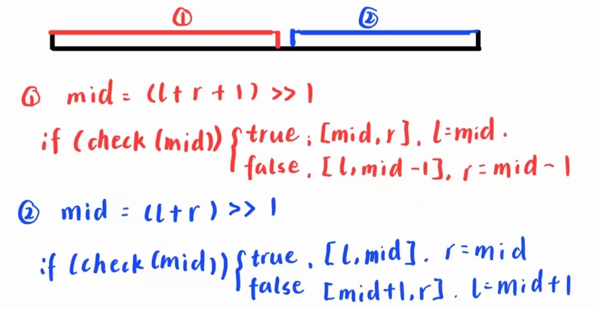

# Acwing

### 浮点数二分

```c
def EggDrop(e,f)
for i = 2 to e
    x = 1	//交点x0初始化
    for j = 2 to f
        //找到第一个T1(x) >= T2(x)的点
		while(x < j && dp[i-1][x-1] < dp[i][j-x])
           x++
        //取T1(x)和T2(x-1)的较小值 + 1
		dp[i][j] = min(dp[i-1][x-1],dp[i][j-x+1]) + 1
return dp[e][f]
```


```c
def EggDrop(e,f)
dp = new int[e + 1](0)
m = 0	//试验次数
    while(dp[e] < f)
      	for i = e to 0
            dp[i] = dp[i] + dp[i-1] + 1
        m++;
return m
```


```c
def EggDrop(dp,e,f)
for i = 2 to e
    for j = 2 to f
        low = 1,high = j
        while low < high
            mid = (low + high + 1)/2
            t1 = dp[i - 1,mid - 1]	//T1(mid)
            t2 = dp[i,j - mid]		//T2(mid)

            if(t1 > t2)
                high = mid - 1
            else
                low = mid
		dp[i][j] = max(dp[i - 1][low - 1], dp[i][j - low]) + 1
return dp[e][f]
```


```c
def EggDrop(dp,e,f)
//dp初始化为-1并赋值边界条件
if dp[e][f] != -1
    return dp[e][f]
low = 1,high = f
while low < high
    mid = (low + high + 1)/2
    t1 = EggDrop(e - 1,mid - 1)	//T1(mid)
    t2 = EggDrop(e,f - mid)		//T2(mid)
    
    if(t1 > t2)
        high = mid - 1
    else
        low = mid
dp[e][f] = max(dp[e - 1][low - 1], dp[e][f - low]) + 1
return dp[e][f]
```


```c
def EggDrop(dp,e,f)
//dp初始化为-1并赋值边界条件
if dp[e][f] != -1
    return dp[e][f]

ans = f
//选择第x层扔鸡蛋
for x = 1 to f
	dp[] = min(ans, max(EggDrop(e - 1,x - 1),EggDrop(e,x - i)) + 1)    
return ans
```


```c
def EggDrop(e,f)
//边界条件
if e = 1 or f = 0 or f = 1
    return f
    
ans = f
//选择第x层扔鸡蛋
for x = 1 to f
    ans = min(ans, max(EggDrop(e - 1,x - 1),EggDrop(e,x - i)) + 1)
return ans
```


```c
def EggDrop(dp,e,f)
//边界条件
for i = 1 to f
    dp[1][i] = i

for i = 2 to e	//i个鸡蛋
    for j = 1 to f	//j层楼
      	dp[i][j] = INT_MAX	//初始化最大值
        for x = 1 to j	//选择第x层扔鸡蛋
            //状态转移方程
            dp[i][j] = min(dp[i][j], 1 + max(dp[i][j-x],dp[i-1][x-1]))
return dp[e][f]   
```

## 基础算法

### 快速排序

```c
#include <iostream>
using namespace std;

void quick_sort(int a[], int l, int r)
{
    if (l >= r)
        return;

    int x = a[l], i = l, j = r;
    while (i < j)
    {
        while (a[i] < x)
            i++;
        while (a[j] > x)
            j--;
        if (i < j)
            swap(a[i], a[j]);
    }
    quick_sort(a, l, j);
    quick_sort(a, j + 1, r);
}

int main()
{
    int n = 9;
    int a[] = {10, 9, 7, 6, 11, 2, 5, 8, 3};

    quick_sort(a, 0, n - 1);
    for (int i = 0; i < n; i++)
        cout << a[i] << " ";

    return 0;
}
```

### 归并排序

```c
#include <iostream>
using namespace std;

int n = 9;
int a[] = {1, 9, 6, 6, 12, 14, 6, 7, 3};
int temp[10] = {0};

void merge_sort(int a[], int l, int r)
{
    if (l >= r)
        return;

    int mid = (l + r) >> 1;

    merge_sort(a, l, mid);
    merge_sort(a, mid + 1, r);

    int k = 0, i = l, j = mid + 1;
    while (i <= mid && j <= r)
        if (a[i] <= a[j])
            temp[k++] = a[i++];
        else
            temp[k++] = a[j++];
    while (i <= mid)
        temp[k++] = a[i++];
    while (j <= r)
        temp[k++] = a[j++];

    for (i = l, j = 0; i <= r; i++, j++)
        a[i] = temp[j];
}

int main()
{
    merge_sort(a, 0, n - 1);

    for (int i = 0; i < n; i++)
        cout << a[i] << ' ';
    return 0;
}
```

### 整数二分

例题：数的范围

输入n个数字和m次查询，数字升序，输出查询数字在数组中的左右边界，不存在输出”-1 -1“

注意找右边界时为 **mid = (l+r+1) >> 1**

****

```c
/*
    输入：
    6 3
    1 2 2 3 3 4
    3
    4
    5
    输出
    3 4
    5 5
    -1 -1
*/

#include <iostream>
using namespace std;

const int N = 10010;
int n, m, x, a[N];

int main()
{
    cin >> n >> m;
    for (int i = 0; i < n; i++)
        cin >> a[i];

    while (m--)
    {
        int x;
        cin >> x;

        int l = 0, r = n - 1;
        while (l < r)
        {
            int mid = (l + r) >> 1;
            if (a[l] >= x)
                r = mid;
            else
                l = mid + 1;
        }
        if (a[l] != x)
            cout << "-1 -1" << endl;
        else
        {
            cout << l << ' ';

            int l = 0, r = n - 1;
            while (l < r)
            {
                int mid = (l + r + 1) >> 1;
                if (a[mid] <= x)
                    l = mid;
                else
                    r = mid - 1;
            }
            cout << l << endl;
        }
    }

    return 0;
}
```

### 高精度加减法

```c
#include <iostream>
#include <vector>
#include <algorithm>
using namespace std;

bool cmp(vector<int> &A, vector<int> &B)
{
    if (A.size() != B.size())
        return A.size() > B.size();
    for (int i = A.size() - 1; i >= 0; i--)
    {
        if (A[i] != B[i])
            return A[i] > B[i];
    }
    return true;
}

vector<int> add(vector<int> a, vector<int> b)
{
    vector<int> c;
    int t = 0;
    for (int i = 0; i < a.size() || i < b.size(); i++)
    {
        if (i < a.size())
            t += a[i];
        if (i < b.size())
            t += b[i];
        c.push_back(t % 10);
        t /= 10;
    }
    if (t)
        c.push_back(1);
    return c;
}

vector<int> sub(vector<int> a, vector<int> b)
{
    vector<int> c;
    int t = 0;
    for (int i = 0; i < a.size(); i++)
    {
        t = a[i] - t;
        if (i < b.size())
            t -= b[i];
        c.push_back((t + 10) % 10);
        if (t < 0)
            t = 1;
        else
            t = 0;
    }
    while (c.size() > 1 && c.back() == 0)
        c.pop_back();

    return c;
}

int main()
{
    string a, b;
    cin >> a >> b;

    vector<int> a1, b1;
    for (int i = a.size() - 1; i >= 0; i--)
        a1.push_back(a[i] - '0');
    for (int i = b.size() - 1; i >= 0; i--)
        b1.push_back(b[i] - '0');

    auto add_c = add(a1, b1);
    cout << a << " add " << b << " = ";
    for (int i = add_c.size() - 1; i >= 0; i--)
        cout << add_c[i];
    cout << endl;

    vector<int> sub_c;
    if (cmp(a1, b1))
        sub_c = sub(a1, b1);
    else
        sub_c = sub(b1, a1);

    cout << a << " sub " << b << " = ";
    for (int i = sub_c.size() - 1; i >= 0; i--)
        cout << sub_c[i];
    cout << endl;

    return 0;
}
```

### 高精度乘除法

```c
#include <iostream>
#include <vector>
#include <algorithm>
using namespace std;

vector<int> mul(vector<int> a, int b)
{
    vector<int> c;
    int t = 0;
    for (int i = 0; i < a.size() || t; i++)
    {
        if (i < a.size())
            t += a[i] * b;
        c.push_back(t % 10);
        t /= 10;
    }
    return c;
}

vector<int> div(vector<int> a, int b)
{
    vector<int> c;
    int t = 0;
    for (int i = a.size() - 1; i >= 0; i--)
    {
        t = t * 10 + a[i];
        c.push_back(t / b);
        t %= b;
    }
    reverse(c.begin(), c.end());
    while (c.back() == 0)
        c.pop_back();
    return c;
}

int main()
{
    string a;
    int b;
    cin >> a >> b;

    vector<int> a1;
    for (int i = a.size() - 1; i >= 0; i--)
        a1.push_back(a[i] - '0');

    auto mul_c = mul(a1, b);
    cout << a << " mul " << b << " = ";
    for (int i = mul_c.size() - 1; i >= 0; i--)
        cout << mul_c[i];
    cout << endl;

    auto div_c = div(a1, b);
    cout << a << " div " << b << " = ";
    for (int i = div_c.size() - 1; i >= 0; i--)
        cout << div_c[i];
    cout << endl;
    return 0;
}
```

### 前缀和

sum[i] = $\sum_{i = 0}^{n}a_j$

指定区间[L,R],区间和为Ans = sum[R] - sum[L-1]

```c
//一维前缀和
#include <iostream>
using namespace std;

const int N = 1e7 + 5;
int n, Q, a[N], sum[N];

int main()
{
    cin >> n;
    sum[0] = 0;
    for (int i = 1; i <= n; i++)
    {
        cin >> a[i];
        sum[i] = sum[i - 1] + a[i];
    }
    cin >> Q;
    while (Q--)
    {
        int L, R;
        cin >> L >> R;
        cout << sum[R] - sum[L - 1] << endl;
    }

    return 0;
}
```

```c
//二维前缀和
#include <iostream>
#include <vector>
using namespace std;

const int N = 1010;
int n, m, q;
int a[N][N], s[N][N];

int main()
{
    cin >> n >> m >> q;
    for (int i = 1; i <= n; i++)
        for (int j = 1; j <= n; j++)
            cin >> a[i][j];
    for (int i = 1; i <= n; i++)
        for (int j = 1; j <= n; j++)
            s[i][j] = a[i - 1][j] + a[i][j - 1] - s[i - 1][j - 1] + a[i][j];

    while (q--)
    {
        int x1, y1, x2, y2;
        cin >> x1 >> y1 >> x2 >> y2;
        cout << s[x2][y2] - s[x1 - 1][y2] - s[x2][y1 - 1] + s[x1 - 1][y1 - 1];
    }

    return 0;
}
```

### 差分

#### 定义

b~i~ = a~i~ - a~i-1~(i>1) or a~1~(i=1) 

b~i~ 的前缀和为原数组a~i~

给定区间\[L,R](length<1e7)加减的操作，求最终结果数组。  

```c
//一维差分
#include <iostream>
using namespace std;

const int N = 1e7 + 5;
int n, a[N], b[N], sum[N];

int main()
{
    cin >> n;
    for (int i = 1; i <= n; i++)
    {
        cin >> a[i];
        b[i] = a[i] - a[i - 1];
    }

    int L, R, num;
    cin >> L >> R >> num;

    b[L] += num, b[R + 1] += num;   //!操作
    for (int i = 1; i <= n; i++)
    {
        cout << a[i] << " ";
        sum[i] = sum[i - 1] + b[i];
    }
    cout << endl;
    for (int i = 1; i <= n; i++)
        cout << sum[i] << " ";

    return 0;
}
```

```c
//二维差分
#include <iostream>
using namespace std;

const int N = 1010;
int n, m, q;
int a[N][N], b[N][N];

void Insert(int x1, int y1, int x2, int y2, int c)
{
    b[x1][y1] += c;
    b[x2 + 1][y1] -= c;
    b[x1][y2 + 1] -= c;
    b[x2 + 1][y2 + 1] += c;
}

int main()
{
    cin >> n >> m >> q;

    for (int i = 1; i <= n; i++)
        for (int j = 1; j <= m; j++)
            cin >> a[i][j];

    for (int i = 1; i <= n; i++)
        for (int j = 1; j <= m; j++)
            Insert(i, j, i, j, a[i][j]);

    while (q--)
    {
        int x1, y1, x2, y2, c;
        cin >> x1 >> y1 >> x2 >> y2 >> c;
        Insert(x1, y1, x2, y2, c);
    }
    for (int i = 1; i <= n; i++)
        for (int j = 1; j <= m; j++)
            b[i][j] += b[i - 1][j] + b[i][j - 1] - b[i - 1][j - 1];

    for (int i = 1; i <= n; i++)
    {
        for (int j = 1; j <= m; j++)
            cout << b[i][j] << ' ';
        cout << endl;
    }

    return 0;
}
```

### 双指针算法

```c
// 最长连续子序列
#include <iostream>
using namespace std;

const int N = 100010;
int n;
int a[N], s[N];

int main()
{
    cin >> n;
    for (int i = 0; i < n; i++)
        cin >> a[i];

    int res = 0;
    for (int i = 0, j = 0; i < n; i++)
    {
        s[a[i]]++;
        while (s[a[i]] > 1)
        {
            s[a[j]]--;
            j++;
        }
        res = max(res, i - j + 1);
    }
    cout << res << endl;

    return 0;
}
```

### 位运算

```c
//取n的第k位：（n >> k) & 1
//返回x的最后一位1：x & -x, 10010 返回 10 
#include <iostream>
using namespace std;

int lowbit(int x)
{
    return x & -x;
}

int main()
{
    // 求n的二进制表示
    int n = 10;
    for (int k = 3; k >= 0; k--)
        cout << (n >> k & 1);
    cout << endl;

    // 统计x的1的个数
    int m;
    cin >> m;
    while (m--)
    {
        int x;
        cin >> x;
        int res = 0;
        while (x)
        {
            x -= lowbit(x);
            res++;
        }
        cout << res << endl;
    }

    return 0;
}
```

### 离散化

```c
// 802 区间和
#include <iostream>
#include <vector>
#include <algorithm>
using namespace std;

typedef pair<int, int> PII;

const int N = 300010;
int a[N], s[N];		//a存放下标对应的值
int n, m;
vector<int> alls;	//存放下标
vector<PII> add, query;	

int find(int x)
{
    int l = 0, r = alls.size() - 1;

    while (l < r)
    {
        int mid = (l + r) >> 1;
        if (alls[mid] >= x)
            r = mid;
        else
            l = mid + 1;
    }
    return r + 1;
}

int main()
{
    cin >> n >> m;
    for (int i = 0; i < n; i++)
    {
        int x, c;
        cin >> x >> c;
        add.push_back({x, c});
        alls.push_back(x);
    }

    for (int i = 0; i < m; i++)
    {
        int l, r;
        cin >> l >> r;
        query.push_back({l, r});
        alls.push_back(l);
        alls.push_back(r);
    }
    // 去重
    sort(alls.begin(), alls.end());
    alls.erase(unique(alls.begin(), alls.end()), alls.end());

    // 处理插入
    for (auto item : add)
    {
        int x = find(item.first);
        a[x] += item.second;
    }

    // 前缀和
    for (int i = 1; i <= alls.size(); i++)
        s[i] = s[i - 1] + a[i];

    // 处理询问
    for (auto item : query)
    {
        int l = find(item.first), r = find(item.second);
        cout << s[r] - s[l - 1] << endl;
    }

    return 0;
}
/*  输入：
    3 3
    1 2
    3 6
    7 5
    1 3
    4 6
    7 8
    输出：
    8
    0
    5
*/
```

### 区间合并

```c
// 805 区间合并
#include <iostream>
#include <vector>
#include <algorithm>
using namespace std;

typedef pair<int, int> PII;
const int N = 100010;

int n;
vector<PII> segs;

void merge(vector<PII> &segs)
{
    vector<PII> res;

    sort(segs.begin(), segs.end());

    int st = -2e9, ed = -2e9;
    for (auto seg : segs)
    {
        if (ed < seg.first)
        {
            if (st != -2e9)
                res.push_back({st, ed});
            st = seg.first, ed = seg.second;
        }
        else
            ed = max(ed, seg.second);
    }
    if (st != -2e9)
        res.push_back({st, ed});
    segs = res;
}

int main()
{
    cin >> n;
    for (int i = 0; i < n; i++)
    {
        int l, r;
        cin >> l >> r;
        segs.push_back({l, r});
    }

    merge(segs);
    cout << segs.size() << endl;
    return 0;
}

/*  输入：
    5
    1 2
    2 4
    5 6
    7 8
    7 9
    输出：
    3
*/
```

### 栈

```c
// 单调栈
#include <iostream>
using namespace std;

const int N = 100010;
int n;
int stk[N], tt;

int main()
{
    cin >> n;
    for (int i = 0; i < n; i++)
    {
        int x;
        cin >> x;
        while (tt && stk[tt] >= x)
            tt--;
        if (tt)
            cout << stk[tt] << " ";
        else
            cout << "-1 ";
        stk[++tt] = x;
    }

    return 0;
}
```

### 队列


### 公约数和公倍数

```c
int gcd(int a, int b)
{
    if (b == 0)
        return a;
    return gcd(b, a % b);
}

int lcm(int a, int b)
{
    int c = a * b;
    return c / gcd(a, b);
}
```

### 并查集

```c
#include <iostream>
using namespace std;

const int MAXN = 1000;
int fa[MAXN];

int find(int x)
{
    return x == fa[x] ? x : (fa[x] = find(fa[x]));
}

void merge(int i, int j)
{
    fa[find(i)] = find(j);
}

int main()
{
    for (int i = 0; i < MAXN; i++)
        fa[i] = i;

    return 0;
}
```

### 数字和字符串转化

```c
#include <iostream>
#include <sstream>
using namespace std;

int main()
{
    // 数字转换为字符串
    int num = 123;
    stringstream ss;
    ss << num;
    string s = ss.str();
    cout << s << endl;

    // 字符串转换成数字
    string s1 = "123";
    int num1 = atoi(s1.c_str());
    cout << num1 << endl;

    string s2 = "456";
    stringstream ss2;
    ss2 << s2;
    int num2;
    ss2 >> num2;
    cout << num2 << endl;
    return 0;
}
```

